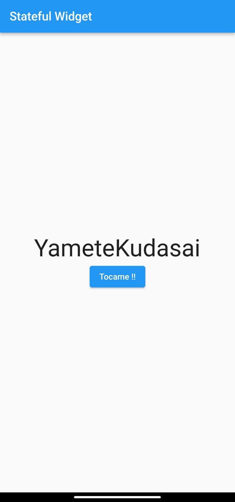
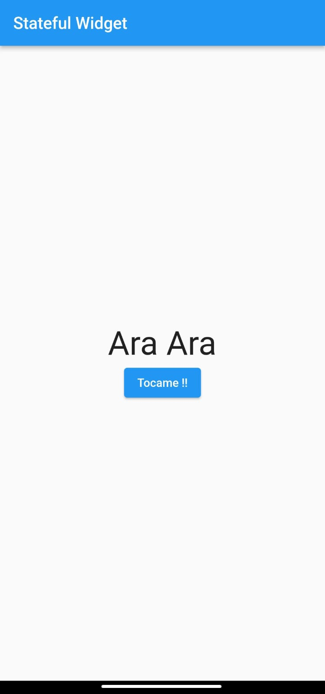
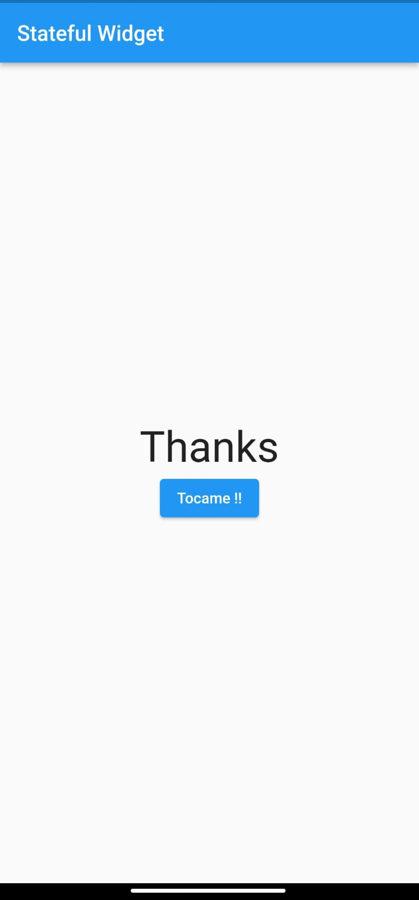

# practica6_200931 - Widget de Botón Personalizado

## Información General

- **Creado por:** Uriel Maldonado Cortez
- **Asignatura:** Desarrollo Movil Integral
- **Grado:** 10
- **Grupo:** A
- **Docente:** MTI. Marco Antonio Ramirez Hernandez

## Descripción de la Aplicación
Este es un ejemplo simple de un widget de botón personalizado en Flutter. El widget tiene un botón que cambia su texto cuando se presiona.

## Captura de Pantalla

  
  
  

## Instalación

Para ejecutar esta aplicación, sigue estos pasos:

1. Asegúrate de tener Flutter y Dart instalados en tu sistema.

2. Clona este repositorio o descarga el código fuente.

3. Abre una terminal en la carpeta del proyecto.

4. Ejecuta `flutter pub get` para obtener las dependencias.

5. Ejecuta `flutter run` para iniciar la aplicación en un emulador o dispositivo físico.

